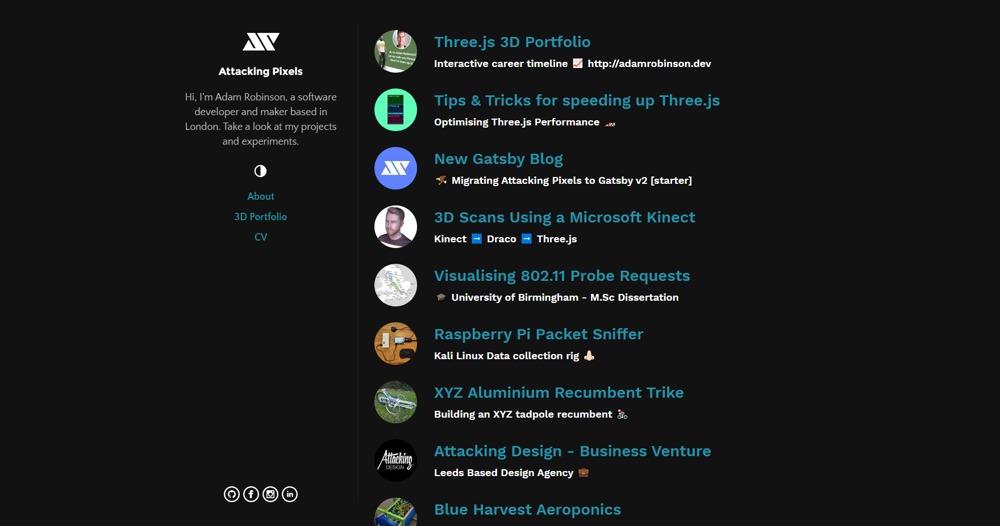

<!-- AUTO-GENERATED-CONTENT:START (STARTER) -->
<p align="center">
  <a href="https://www.gatsbyjs.org">
    
  </a>
</p>
<h1 align="center">
  gatsby-starter-baysik-blog
</h1>

<h4 align="center">A basic starter for creating blogs using Gatsby.</h4>




## Quick Start

#### Create a Gatsby site

Use the Gatsby CLI to create a new site, specifying the Baysik starter.

```sh
# Create a new Gatsby site using the Baysik starter
gatsby new baysik-blog https://github.com/adamistheanswer/gatsby-starter-baysik-blog
```

#### Start Developing

Navigate into your new site’s directory and start it up.

```sh
cd baysik-blog
gatsby develop
```

#### Open the source code and start editing!

Your site is now running at `http://localhost:8000`!

Note: You'll also see a second link: `http://localhost:8000/___graphql`. This is a tool you can use to experiment with querying your data. Learn more about using this tool in the [Gatsby tutorial](https://www.gatsbyjs.org/tutorial/part-five/#introducing-graphiql).


## Changelog

All notable changes to this project will be documented in this file.

## [2.0.0] - 2020-07-01

### Added

- Lunr Local Search
- MDX for embedding React components into individual blog posts

### Changed
- Almost everything

## [1.0.0] - 2019-11-01

- Initial Release

# Todo

- [] Quickstart Guide
- [] User can setup mostly from gatsby-config
- [] Social Icons & Dev Icons improve implimentation
- [] Trim the fat!
